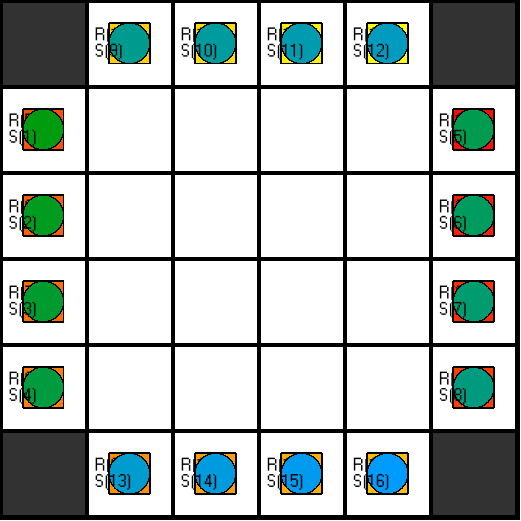
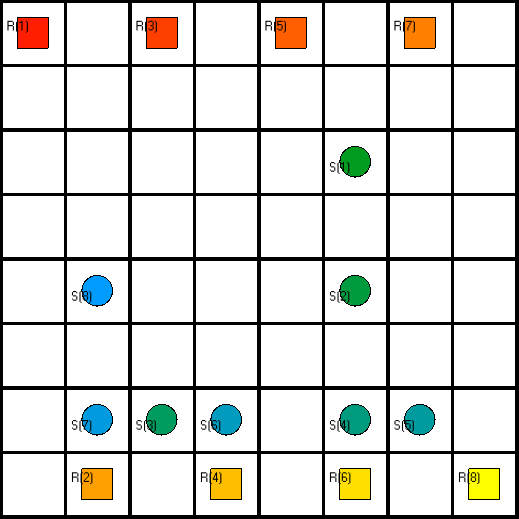
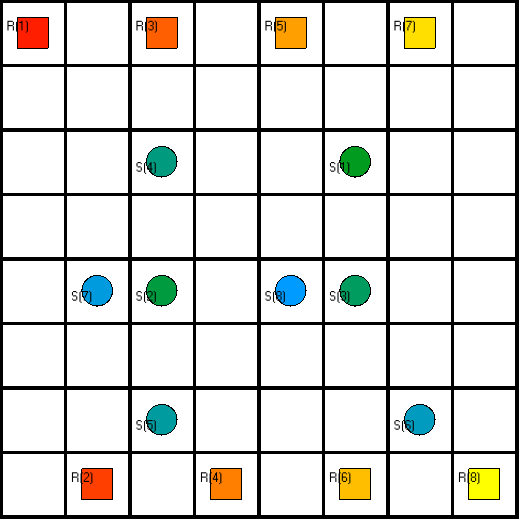
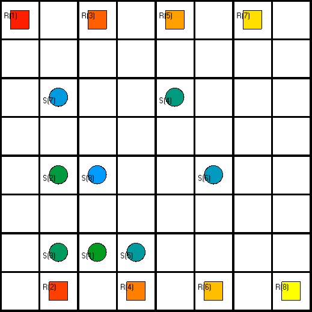
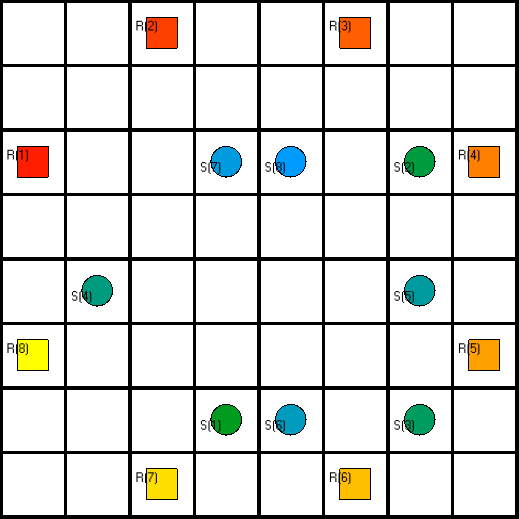
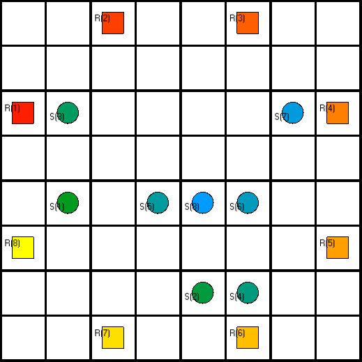
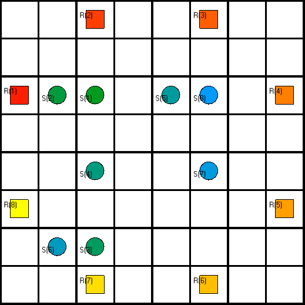
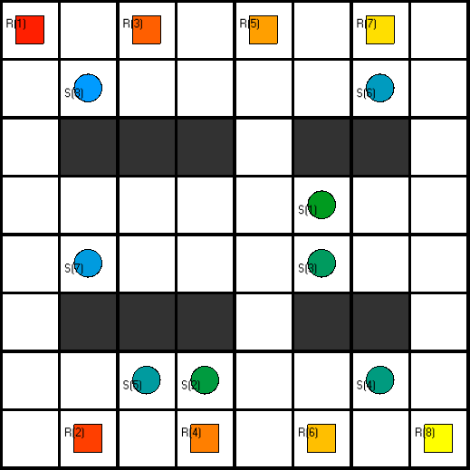
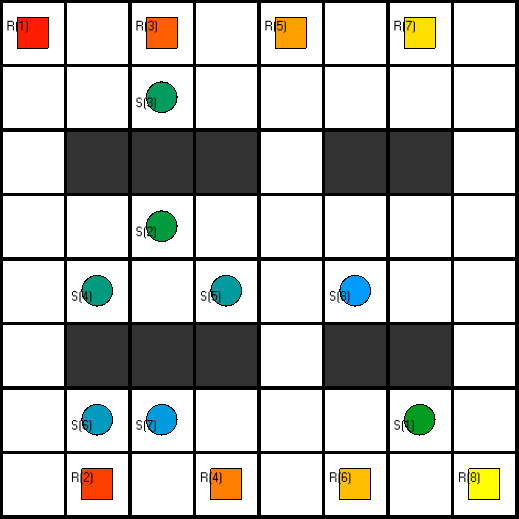
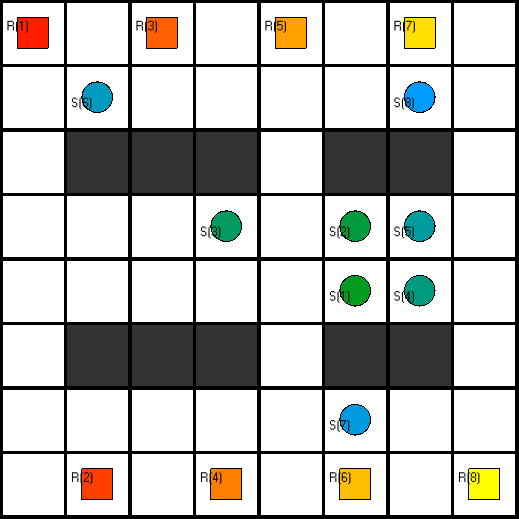

# example instances

## big_problem.lp
16 robots try to cross a crossroad at the same time. This is not the setup for a joke, but a very serious problem. Hard to solve, so expect a long runtime.

## warehouse problems
The following examples try to simulate more realistic warehouse-scenarios. There are three categories:

### warehouse1_X.lp

warehouse1_1.lp

warehouse1_2.lp

warehouse1_3.lp

# warehouse2_X.lp

warehouse2_1.lp

warehouse2_2.lp

warehouse2_3.lp

# warehouse3_X.lp

warehouse3_1.lp

warehouse3_2.lp

warehouse3_3.lp

