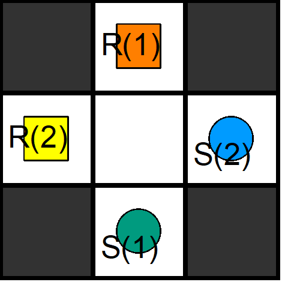
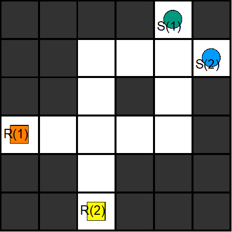
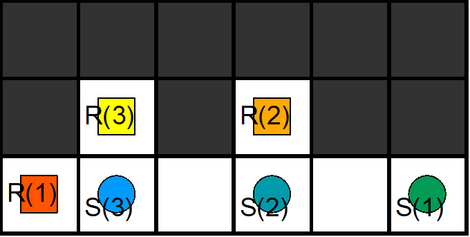
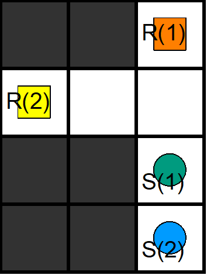
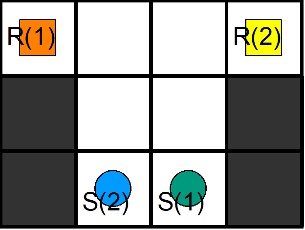
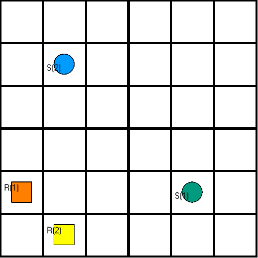
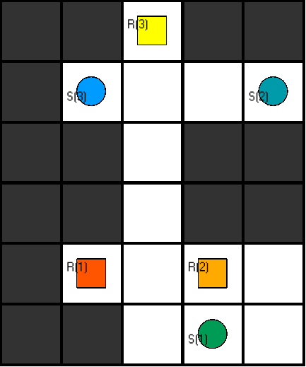
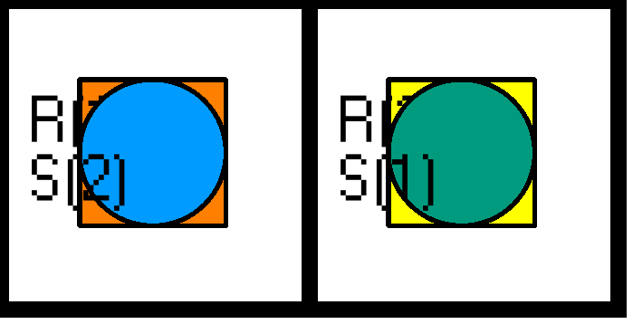

# example instances

## easy_cross.lp
This file contains the easiest vertex conflict imaginable with two robots.

## double_cross.lp
Tests, whether two consecutive vertex conflicts can be solved - no dodging possible.

## three_robots.lp
This file tests the programs behaviour if there are two collisions with a total of three robots.

## timingConflict.lp
In this case a vertex conflict cannot be avoided simply by waiting - it is necessary to look at past moves.

## easy_edgeConflict.lp
This file contains plans for a very simple edge conflict.

## wide_and_simple.lp
This file is a vertex-confict with much space to see how it will be solved in an open eviroment.

## bottleneck.lp
This file contains a small passage and three robot who want to cross it in different directions. Multiple vertex- and edge-conflicts have to be solved.

## easy_unsat.lp
Very small example with no possible solution.

